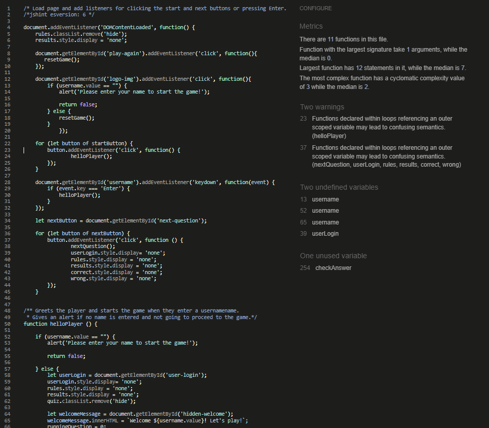

# __Global Citizen - The Ultimate Geography Quiz | Portfolio Project II__

This is a fun game where the user can match countries with their capitals.

## Live Site

https://vivienrauch.github.io/JavaScript-Essentials-Portfolio-Project-Geography-Quiz/

https://ui.dev/amiresponsive?url=%20https://vivienrauch.github.io/JavaScript-Essentials-Portfolio-Project-Geography-Quiz/

## Repository

https://github.com/vivienrauch/JavaScript-Essentials-Portfolio-Project-Geography-Quiz

# Table of Contents

- [UX Design](#ux-design)
    * [Objective](#objective---stragety-plane)
        * [User Stories](#user-stories)
    * [Features](#features---scope-skeleton--structure-plane)
        * [Wireframes](#wireframes)
        * [Existing Features](#existing-features)
        * [Future Features](#future-features)
        * [Colors](#colors)
        * [Fonts](#fonts)
- [Testing](#testing)
    * [Accessibility & Performance](#accessibility--performance)
    * [Validator Testing](#validator-testing)
        * [HTML](#html)
        * [CSS](#css)
        * [JavaScript](#javascript)
* [Bugs](#bugs)
    * [Fixed Bugs](#fixed-bugs)
    * [Unfixed Bugs](#unfixed-bugs)
* [Development](#development)
* [Technologies Used](#technologies-used)
* [Deployment](#deployment---surface-plane)
* [Credits](#credits)

# UX Design

## **Objective** - *Stragety Plane*

The objective while creating this multiple choice quiz game was to utilize HTML, CSS and JavaScript in order to build a simple and intuitive game while providing pleasing aesthetics, interactivity and a dynamic flow for the user.

### **User Stories**

As a user, I:
- want to arrive to a page that feels like 'home'
- want to be able to easily navigate the page
- want to see colors that are not too straining for the eye
- want to understand the game rules without the need to read extensive amounts of text
- want to be able to see how many questions I got right from how many questions
- want to be able to skip the question if I can't/don't want to answer
- want to be able to see the final results and have the option to play again

## **Features** - *Scope, skeleton & structure plane*

### **Wireframes**

I was going for an intuitive and straightforward and clear design with not too many options or stimulation.

### **Colors**

I went for the aesthetics of an antique environment, like an old ship where sailors are looking at the map of the world over an old wooden table in the dark with only a couple of candles providing light. I imagined earthy colors which represent our lands with a touch of blue which represents our seas and oceans. I found a picture on Pinterest that matched the vibe I was looking for and I pretty much went with its color palette.

### **Fonts**

I chose the **Amatic SC**, **Cinzel** and **Crimson Text** font families for this page. The **Amatic SC** has a little playfulness in it which complements and eases up the dominant color palette that could turn too heavy with an equally dominant font style. However, I found that it kind of disappears when I put it in the game area or on the Start button. I needed something that pops a little more, and that's when I decided to use **Cinzel**for these elements and **Crimson Text** for the rules and results.
I imported them from [Google Fonts](https://fonts.google.com/).

### **Existing Features**

- Logo

The logo clarifies the type of game right from the get go. I wanted to add some functionality to it, so when the user clicks the logo, it resets the game, shows the rules panel again and the user can click *continue* to load the first question. I added some shadow to it when the user hovers over it so it indicates for them that it's a clickable feature.

- User area

Here the user enters their name. The game only starts if the user enters their name, if not, they will get an alert.

- Rules

When the user hasn't entered the game yet this is the section they meet first, where they can read about how the game works.

- Game area

Once the user entered their name, this is the first question they will see. The answer options pop out when they hover over them. Below the options the user can see how many answers they have got right from all the questions. On the right side there is the next button which can function as a skip button as well.

- Results

Once the user completed the quiz, they will be navigated to this page where they can see their final results and start a new game if they wish.

- Footer

This section contains social links for the game developer's theoretical other games and gaming community.

### **Future Features**

In the future I'd like to improve this game by adding either new windows or tabs where the user can choose the continent they want to play with and provide more questions to each continent accordingly; also to add the green and red background to the corresponding options. To a game in that scope I'd also add registration and log out functionality.
Overall, I'd find a way to not use global variables and thus make the game more secure.

# **Testing**

## **Accessibility & Performance**

- Lighthouse:

    

## Validator Testing

### **HTML**

The HTML validation shows no error, only one warning with a section lacking heading - which was intented and thus needs no correction.

### **CSS**

The CSS validator returned no errors.

### **JavaScript**

The JavaScript validator returned no errors.

# **Bugs**

## **Fixed Bugs**

- The game didn't start when a username is entered.
    - **Fix**: Calling the *renderQuestion* function and setting the *runningQuestion* to 0, so it starts with the first question.
    
    

- When the next button was clicked, the next question didn't get rendered.
    - **Fix**: It wasn't enough to just increment the questions and call the *renderQuestion* function, but inside the brackets   it needed the *runningQuestion* specification.

    

- The hardest one to solve in this project was to only allow one click per question.
    - **Fix**: I needed to find a way to reference all the answers, loop through them and disable the clicking after one click and then enable it again for the next question. So I created a variable that targets all the answers' class, I looped through them and added a class with *pointer-events: none;* and in the *nextQuestion* function I removed the class so it enabled clicking again.

       

## **Unfixed Bugs**

My original idea was to color the background of the correct answer green and to color the background of the wrong answer red. For some reason I couldn't make it work properly, so I went with the alternative of showing the validation under the options.

An other issue that occurred and I haven't succeeded to figure out the reason of was the results panel appearing in a selected mode on the page, and the user has to click somewhere on the page for it to unselect.

# **Technologies Used**

- Languages:

    - **HTML**
    - **CSS**
    - **JavaScript**

- Other tools:

    - [Gitpod](https://gitpod.io/) for development
    - [Github](https://github.com) for publishing
    - [Canva](https://www.canva.com/) creating the logo
    - [Balsamiq](https://balsamiq.com/) for creating a wireframe mockup
    - [Pexels](https.//pexels.com/) for the images
    - [Font Awesome](https://fontawesome.com/) for the icons used throughout the site
    - [Box Shadow Generator](https://cssgenerator.org/box-shadow-css-generator.html) for adding dynamics to the buttons
    - [favicon.io](https://favicon.io/favicon-converter/) to create a favicon

# **Deployment** - *Surface plane*

I deployed the site to GitHub pages and the steps were the following:

- In [my repository](https://github.com/vivienrauch/JavaScript-Essentials-Portfolio-Project-Geography-Quiz), I navigated to **Settings**
- In **Settings**, I navigated to **Pages**
- From the source section I selected "**main**"
- Clicked on "**Save**" and the page provided me with the following live link after deployment:

https://vivienrauch.github.io/JavaScript-Essentials-Portfolio-Project-Geography-Quiz/

# **Development**

You can get up and running by:

- going to the [Github Repository](https://github.com/vivienrauch/JavaScript-Essentials-Portfolio-Project-Geography-Quiz)
- navigate to the [Gitpod Workspace](https://gitpod.io/workspaces)
- once it opens, open up a New Terminal
- type "**python3 -m http.server**"
- click on "**Open Browser**" - that will open up your site in a new browser tab where you can check how your changes are implemented
- open up the tabs you want to work on, and have fun!

# **Credits**

- The project in part relies on the methods learnt through the [Love Maths Walkthrough Project](https://github.com/vivienrauch/love-maths)
- The list of sites and Youtube videos I used to clarify the way to build a multiple choice quiz game (I borrowed some code here and there but they are heavily personalized and also indicated in the files):
    - https://www.youtube.com/watch?v=f4fB9Xg2JEY
    - https://www.youtube.com/watch?v=49pYIMygIcU
    - https://www.youtube.com/watch?v=WHHYz8rZmDU
    - https://gamedevacademy.org/javascript-quiz-tutorial/
